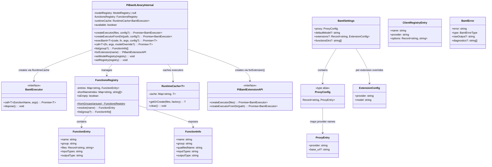

# pi-baml — BAML Integration for Pi Coding Agent

> **Status:** V1 implemented. See `docs/architecture.md` for runtime details and `docs/configuration.md` for settings reference.

## Requirements

- Bridge BAML's structured output runtime with Pi's provider system, enabling typed LLM function calls from extensions and dynamic authoring by the agent
- Allow Pi extensions to define and execute `.baml` functions using Pi's configured model providers (hai-proxy, github-copilot, etc.) without separate credential management
- Provide an agent-facing tool for invoking pre-defined BAML functions by name from a discoverable registry
- Provide an agent-facing tool for dynamically authoring and executing BAML code at runtime
- Ship a bundled skill teaching the agent to write correct BAML code
- Publish as an npm package (`pi-baml`) installable via Pi's package system
- Expose a library API via Pi's EventBus for other extensions to consume

### Definition of Done

- ✅ `npm:pi-baml` installs cleanly and loads without error in Pi
- ✅ Local extensions can receive the library via EventBus and compile/execute .baml files
- ✅ Agent can call `baml_list` to discover available functions
- ✅ Agent can call `baml_run` to invoke registry functions with typed results
- ✅ Agent can call `baml_exec` to author + compile + execute dynamic BAML code
- ✅ Proxy config routes BAML provider calls through Pi's providers (credentials + base_url resolved from Pi's ModelRegistry)
- ✅ Soft-fail with `available: false` if `@boundaryml/baml` native binary fails to load
- ✅ Unit tests cover bridge logic (72 tests); integration tests cover actual BAML compilation (10 tests, 1 gated behind env var)

## Entities



## Approach

### Strategy

pi-baml is a published npm package that provides three capabilities:

1. **Bridge layer (library):** Connects BAML's `BamlRuntime` to Pi's `ModelRegistry`. Resolves credentials and base URLs from Pi's provider system, creates `ClientRegistry` instances that BAML's runtime uses to route API calls through Pi's proxies.

2. **Tool extension:** Registers `baml_list`, `baml_run`, and `baml_exec` tools that the agent can invoke. Uses the bridge layer internally.

3. **Bundled skill:** Teaches the agent to write correct `.baml` code for dynamic authoring via `baml_exec`.

### Key Design Decisions

**Provider bridge via ClientRegistry (not env vars alone):**
BAML's shorthand `client "anthropic/model"` defaults to Anthropic's public URL. We can't just set `ANTHROPIC_API_KEY` — we also need to override `base_url` for proxies. The `ClientRegistry.addLlmClient()` API accepts both `api_key` and `base_url` in its options, making it the correct integration point.

**EventBus for cross-extension sharing:**
Pi's jiti loader only aliases built-in packages. Local extensions cannot `import` from npm packages directly. The EventBus (`pi.events`) provides a clean communication channel. pi-baml emits `"pi-baml:ready"` during its factory function, ensuring all previously-loaded extensions receive the library reference before `session_start` fires.

**Functions registry (like skills):**
Pre-authored `.baml` files live in discoverable directories (`~/.agents/baml/`, `~/.pi/baml/`, `cwd/.pi/baml/`). Each subdirectory is one compilation unit. Functions are referenced by name (or `group/name` on collision). This makes `baml_run` trivial — pass a function name, get typed results.

**File-based functions declare their own model:**
`.baml` files use standard BAML syntax (`client "anthropic/claude-4.5-haiku"`). pi-baml's proxy config routes the provider through Pi's endpoints. Extensions that want pi-baml don't need to specify models — the `.baml` file owns that decision.

**Dynamic functions use a configured default:**
Agent-authored code uses `client PiClient`. pi-baml resolves `PiClient` from `settings.json` → `baml.defaultModel`. Agent can override per-call via tool params.

### Alternatives Rejected

- **Direct npm import from local extensions:** Not feasible — Pi's jiti loader doesn't resolve arbitrary npm packages from extension directories.
- **Auto-detection of Pi providers to BAML providers:** Ambiguous when multiple Pi providers serve the same API type. Explicit proxy map is predictable.
- **Streaming in V1:** Adds complexity for minimal gain in the primary use cases (classification, extraction). Deferred.
- **Slash commands (`/baml list`, `/baml reload`):** Nice-to-have but not essential for V1. Agent can use `baml_list` tool instead. Deferred.
- **TypeBox for tool parameters:** Originally planned, but plain JSON Schema objects are simpler and avoid an import dependency in tool files. TypeBox can be added later if schema complexity grows.

## Structure

```
pi-baml/                              ← npm package root
├── package.json                      ← pi manifest + @boundaryml/baml dep
├── tsconfig.json                     ← strict ESM, exactOptionalPropertyTypes
├── tsup.config.ts                    ← ESM bundler, externalizes @boundaryml/baml
├── vitest.config.ts                  ← unit test config
├── vitest.integration.config.ts      ← integration test config (30s timeout)
├── eslint.config.js                  ← ESLint 9 flat config, TS strict
├── src/
│   ├── index.ts                      ← Extension factory (createPiBamlExtension)
│   ├── eventbus.ts                   ← createPiBamlLibrary, PiBamlLibraryInternal
│   ├── lib/
│   │   ├── types.ts                  ← All shared types (zero logic)
│   │   ├── config.ts                 ← parseBamlSettings(settings) → BamlSettings
│   │   ├── bridge.ts                 ← createClientRegistryConfig, mapBamlProviderToPiApi, parseClientRef
│   │   ├── executor.ts              ← createBamlExecutor(input) → BamlExecutor
│   │   ├── registry.ts              ← FunctionsRegistry.fromGroups(), parseFunctionDeclarations()
│   │   └── cache.ts                 ← RuntimeCache<T> (content-hash based)
│   └── tools/
│       ├── baml-list.ts              ← createBamlListTool(registry) → ToolDefinition
│       ├── baml-run.ts               ← createBamlRunTool(registry, factory) → ToolDefinition
│       └── baml-exec.ts              ← createBamlExecTool(settings, factory) → ToolDefinition
├── skills/
│   └── baml/
│       └── SKILL.md                  ← BAML authoring skill for the agent
├── examples/
│   ├── classify-intent/
│   │   └── main.baml                 ← Literal unions, @description, Jinja conditionals
│   ├── extract-structured/
│   │   └── main.baml                 ← Nested classes, arrays, optionals
│   └── README.md                     ← Explains patterns and usage
├── tests/
│   ├── unit/                         ← 11 files, 72 tests (no network)
│   │   ├── bridge.test.ts            ← Provider mapping, ClientRegistry config (15 tests)
│   │   ├── registry.test.ts          ← Discovery, parsing, resolution (12 tests)
│   │   ├── config.test.ts            ← Settings parsing, defaults, validation (8 tests)
│   │   ├── executor.test.ts          ← Runtime wrapper, error enrichment (6 tests)
│   │   ├── cache.test.ts             ← Hash stability, caching behavior (4 tests)
│   │   ├── eventbus.test.ts          ← Library creation, lazy init, soft-fail (8 tests)
│   │   ├── baml-list.test.ts         ← List tool behavior (3 tests)
│   │   ├── baml-run.test.ts          ← Run tool behavior (4 tests)
│   │   ├── baml-exec.test.ts         ← Exec tool behavior (5 tests)
│   │   ├── index.test.ts             ← Factory integration test (6 tests)
│   │   └── scaffold.test.ts          ← Build verification (1 test)
│   └── integration/                  ← 3 files, 11 tests (real BAML runtime)
│       ├── executor.test.ts          ← Real compilation + live LLM (gated)
│       ├── examples.test.ts          ← All examples compile successfully
│       └── tools.test.ts             ← Registry + compilation end-to-end
├── LICENSE                           ← MIT
└── README.md
```

### Dependency Graph (actual)

```
src/index.ts (createPiBamlExtension)
├── src/lib/config.ts (parseBamlSettings)
├── src/lib/registry.ts (FunctionsRegistry.fromGroups)
├── src/eventbus.ts (createPiBamlLibrary)
│   ├── src/lib/executor.ts (createBamlExecutor)
│   │   ├── src/lib/bridge.ts (createClientRegistryConfig)
│   │   └── @boundaryml/baml (BamlRuntime, ClientRegistry, Collector)
│   ├── src/lib/registry.ts (FunctionsRegistry)
│   └── src/lib/cache.ts (RuntimeCache)
├── src/tools/baml-list.ts (createBamlListTool)
├── src/tools/baml-run.ts (createBamlRunTool)
└── src/tools/baml-exec.ts (createBamlExecTool)
```

### Integration Points with Pi

| Pi API | Usage |
|--------|-------|
| `pi.events.emit("pi-baml:ready", lib)` | Publish library to other extensions |
| `ctx.modelRegistry.getApiKeyForProvider(name)` | Resolve API keys at runtime |
| `pi.registerTool(...)` | Register baml_list, baml_run, baml_exec |
| `pi.on("session_start", ...)` | Capture modelRegistry |
| `pi.settings` | Read baml configuration section |

## Operations

### 1. Project scaffolding ✅
**Files:** `package.json`, `tsconfig.json`, `tsup.config.ts`, `vitest.config.ts`, `vitest.integration.config.ts`, `eslint.config.js`, `.gitignore`, `LICENSE`
- npm package `pi-baml@0.1.0` with `pi` manifest: `{ extensions: ["dist/index.js"], skills: ["skills/baml"] }`
- Dependencies: `@boundaryml/baml@^0.85.0`, `@sinclair/typebox@^0.34.0`
- Dev deps: `typescript@^5.7.0`, `tsup@^8.0.0`, `vitest@^3.0.0`, `eslint@^9.0.0`, `@typescript-eslint/*`
- ESM-only output targeting Node 20+, strict TypeScript with `exactOptionalPropertyTypes`

### 2. Types module ✅
**File:** `src/lib/types.ts`
- Pure type definitions, zero runtime logic
- `ProxyEntry` (provider + optional base_url), `ProxyConfig` (Record alias)
- `ExtensionConfig` (provider + model pair)
- `BamlSettings` (proxy, defaultModel?, extensions?, functionsDirs?)
- `PiBamlConfig` (provider? + model? for per-call config)
- `BamlExecutor` interface: `call<T>(fn, args) → Promise<T>`, `dispose() → void`
- `FunctionEntry` (name, group, files, inputTypes, outputType)
- `FunctionInfo` (adds qualifiedName for display)
- `BamlErrorType` = "compilation" | "execution" | "configuration" | "unavailable"
- `BamlError` (error, type, rawOutput?, diagnostics?)
- `PiBamlLibrary` (full EventBus API shape)
- `PiBamlExtensionAPI` (subset for forExtension)

### 3. Config module ✅
**File:** `src/lib/config.ts`
- `parseBamlSettings(settings: unknown) → BamlSettings`
- Pure function: takes parsed settings object (not file path), returns validated config
- Missing `baml` key → empty defaults (not an error)
- Missing optional fields → undefined (baml_exec requires explicit model param)
- Malformed proxy entries → throws with actionable message naming the bad entry
- Validates: provider field is present string, base_url is string if present

### 4. Provider bridge ✅
**File:** `src/lib/bridge.ts`
- `mapBamlProviderToPiApi(bamlProvider) → string` — static lookup table
- `parseClientRef(ref) → { provider, model? }` — splits "provider/model" format
- `createClientRegistryConfig(input) → ClientRegistryEntry` — pure function producing addLlmClient params
- Two modes: proxy mode (file-based client ref like "anthropic/claude-4.5-haiku") and PiClient mode (resolves from defaultModel setting)
- Model override replaces the model while keeping the provider's proxy routing
- Missing proxy entry → error: `'No proxy configured for provider "X". Add it to settings.json baml.proxy.'`

### 5. Executor wrapper ✅
**File:** `src/lib/executor.ts`
- `createBamlExecutor(input: CreateExecutorInput) → BamlExecutor`
- Compiles via `BamlRuntime.fromFiles("/", files, {})`
- Creates `RuntimeContextManager` and `ClientRegistry` (via bridge)
- `call<T>()`: calls `runtime.callFunction(fn, args, ctx, null, clientRegistry, [collector])`
- Returns `result.parsed(false)` on success
- On `!result.isOk()` or catch: enriches error with `collector.last?.rawLlmResponse`
- `dispose()`: sets disposed flag, subsequent `call()` throws "Executor has been disposed"
- Errors attached as `{ bamlError: BamlError }` property on thrown Error instances

### 6. Functions registry ✅
**File:** `src/lib/registry.ts`
- `parseFunctionDeclarations(source) → ParsedFunction[]` — regex extraction
- `FunctionsRegistry` class with static factory `fromGroups(groups)`
- Builds internal `entries` map (qualified name → FunctionEntry) and `shortNameIndex` (name → qualified names)
- `resolve(name)`: tries qualified name first, then short name; throws on ambiguity with suggestions
- `list(group?)`: returns FunctionInfo[] filtered by optional group
- `isEmpty` getter for empty-registry detection in baml_list

### 7. Runtime cache ✅
**File:** `src/lib/cache.ts`
- `RuntimeCache<T>` generic class
- `getOrCreate(files, factory)`: SHA-256 hash of sorted file contents → cache key
- Hash is stable regardless of key ordering in the files object
- `clear()`: removes all cached entries (for session shutdown)

### 8. EventBus library ✅
**File:** `src/eventbus.ts`
- `createPiBamlLibrary(input) → PiBamlLibraryInternal`
- Returns extended interface with `setModelRegistry()` and `setRegistry()` internal setters
- Available path: all methods assert `modelRegistry !== null` before proceeding
- Unavailable path: all methods throw `"pi-baml: BAML runtime unavailable..."` immediately
- `createExecutor()`: resolves API key, builds clientRef, delegates to `createBamlExecutor` via `RuntimeCache`
- `execBaml()`: compiles fresh (no cache), calls, disposes after use
- `call()`: resolves from FunctionsRegistry, uses RuntimeCache
- `forExtension(name)`: reads `settings.extensions[name]` for pre-configured PiBamlConfig

### 9. Tool: baml_list ✅
**File:** `src/tools/baml-list.ts`
- `createBamlListTool(registry) → ToolDefinition`
- Params: `{ group?: string }`
- Returns JSON array of FunctionInfo, or helpful "No BAML functions found" message with discovery paths
- Minimal tool — registry does the heavy lifting

### 10. Tool: baml_run ✅
**File:** `src/tools/baml-run.ts`
- `createBamlRunTool(registry, executorFactory) → ToolDefinition`
- Params: `{ function: string, args: Record, model?: string }`
- Resolves function from registry → calls executorFactory → calls executor.call()
- Returns JSON-serialized result on success
- Returns JSON-serialized `BamlError` on failure (wraps both registry errors and execution errors)

### 11. Tool: baml_exec ✅
**File:** `src/tools/baml-exec.ts`
- `createBamlExecTool(settings, executorFactory) → ToolDefinition`
- Params: `{ code: string, function: string, args: Record, provider?: string, model?: string }`
- Validates model availability: no defaultModel + no param → configuration error
- Builds modelOverride from provider+model combination
- Returns JSON-serialized result on success
- Returns compilation or execution BamlError on failure

### 12. Extension entry point ✅
**File:** `src/index.ts`
- `createPiBamlExtension(pi, options?) → void` (also default export)
- Reads config via `parseBamlSettings(pi.settings)`
- Creates library via `createPiBamlLibrary()`
- Creates empty FunctionsRegistry (disk discovery deferred to V1.1)
- Emits `"pi-baml:ready"` with library during factory (ADR-004)
- Creates `toolExecutorFactory` closure for tool use
- Registers all three tools with JSON Schema parameter definitions
- On `session_start`: captures `ctx.modelRegistry` via `lib.setModelRegistry()`
- `options.bamlAvailable=false` path: emits `{ available: false }`, tools return error messages

### 13. BAML authoring skill ✅
**File:** `skills/baml/SKILL.md`
- Self-contained reference covering: primitives, literal unions, optionals, arrays, classes, enums
- Prompt patterns: raw strings `#"..."#`, `{{ ctx.output_format }}`, Jinja control flow
- `@description` and `@alias` annotations
- Clear anti-patterns section: no client blocks, no env vars, no generators
- Three complete examples: contact extraction, sentiment classification, code review
- Checklist for validation before submitting BAML code

### 14. Teaching examples ✅
**File:** `examples/`
- `classify-intent/main.baml`: literal unions, `@description`, optional params, Jinja conditionals
- `extract-structured/main.baml`: nested classes, arrays, optional fields, complex output
- `README.md`: explains patterns, usage with baml_run and baml_exec, conventions
- Both examples compile successfully against real BamlRuntime (verified in integration tests)

### 15. Tests ✅
**Files:** `tests/unit/` (11 files, 72 tests), `tests/integration/` (3 files, 11 tests)
- Unit tests mock `@boundaryml/baml` at the system boundary
- Table-driven patterns for bridge mapping (6 providers), config parsing, registry resolution
- Integration tests use real BamlRuntime (no mock) to compile examples
- Live LLM test gated by `PI_BAML_TEST_PROXY_URL` env var (skipped gracefully)
- All tests are black-box through public interfaces

## Norms

- Follow `coding-discipline` skill principles (single responsibility, minimal interface, early return)
- Follow `go-dev` patterns translated to TypeScript:
  - Error handling: explicit, wrap with context, attach structured BamlError as property
  - Interfaces: small, behavior-focused (`BamlExecutor` = 2 methods)
  - Testing: table-driven patterns (bridge, config), test behavior not implementation
  - Data-driven: pure logic (bridge, config, registry) separated from orchestrators (executor, eventbus)
  - Validate at parse time: config rejects bad entries immediately
- Plain JSON Schema for tool parameters (TypeBox not used — simpler for this scope)
- Pure functions where possible; side effects only in the extension factory and event handlers
- No `any` types — enforced by ESLint rule `@typescript-eslint/no-explicit-any: error`
- JSDoc on all public functions
- ESM only — no CommonJS
- `exactOptionalPropertyTypes: true` — conditional spreads for optional fields
- Naming: camelCase for functions/variables, PascalCase for types/interfaces, kebab-case for files

## Safeguards

- **MUST NOT** make network calls during extension loading (factory phase). ✅ All network activity happens at runtime.
- **MUST** emit `pi-baml:ready` from factory function (not `session_start`). ✅ Emitted in `createPiBamlExtension` before `pi.on("session_start")`.
- **MUST** include `available: boolean` in EventBus payload. ✅ When `false`, all methods throw: `"pi-baml: BAML runtime unavailable. @boundaryml/baml native binary failed to load: <reason>"`.
- **MUST** return raw LLM output alongside errors. ✅ Format: `{ error: string, type: BamlErrorType, rawOutput?: string, diagnostics?: string[] }`.
- **MUST NOT** translate or remap model IDs. ✅ Bridge passes model IDs through unchanged.
- **MUST NOT** auto-detect provider mappings. ✅ Explicit proxy config required.
- **MUST** handle call before `session_start`. ✅ Throws `"pi-baml: not initialized. Library methods are available only after session_start."`.
- **MUST** namespace function names by directory on collision. ✅ Error: `"Ambiguous function name 'X'. Use 'group1/X' or 'group2/X'."`.
- **MUST NOT** require `baml-cli`. ✅ Only `@boundaryml/baml` runtime.
- **MUST** cache BamlRuntime per compilation unit. ✅ `RuntimeCache` with SHA-256 content hash.
- **MUST** support three discovery directories with priority. ✅ Registry supports priority ordering (project > pi-local > global).
- ⚠️ **AbortSignal**: Not passed to `callFunction` in V1 — BAML's `callFunction` API does not accept an AbortSignal parameter. Deferred to when BAML adds cancellation support.
- **OUT OF SCOPE for V1:** Streaming, slash commands, BAML test runner integration, generator blocks, multi-file code generation, `createExecutorFromDir` (directory reading from disk — stub throws "not yet implemented").
