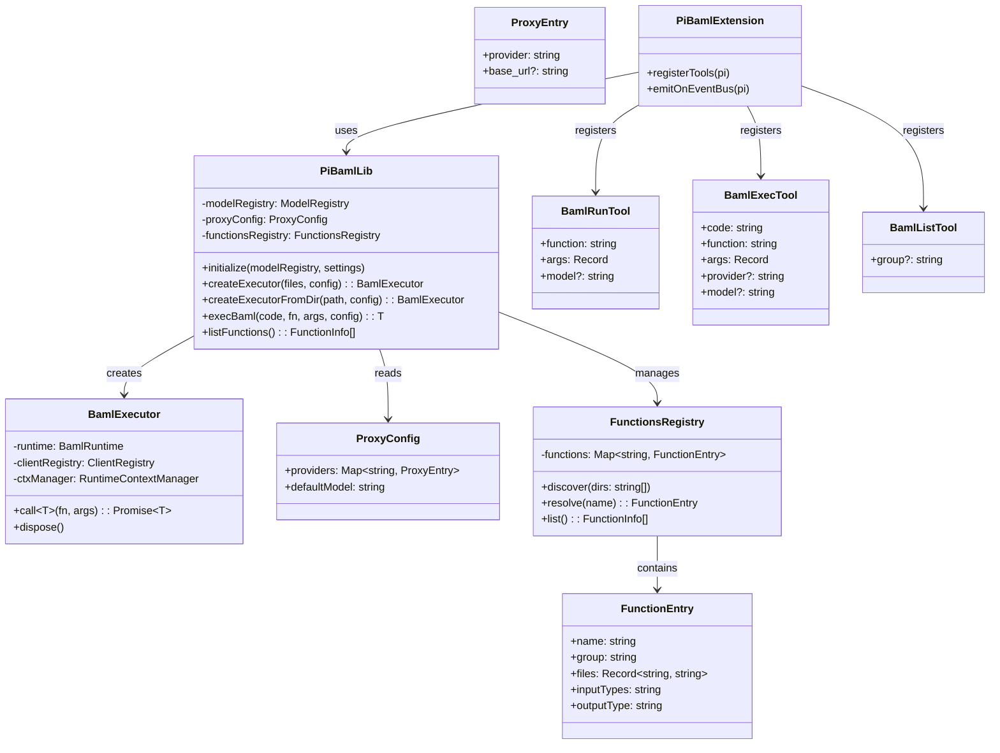

# pi-baml — BAML Integration for Pi Coding Agent

## Requirements

- Bridge BAML's structured output runtime with Pi's provider system, enabling typed LLM function calls from extensions and dynamic authoring by the agent
- Allow Pi extensions to define and execute `.baml` functions using Pi's configured model providers (hai-proxy, github-copilot, etc.) without separate credential management
- Provide an agent-facing tool for invoking pre-defined BAML functions by name from a discoverable registry
- Provide an agent-facing tool for dynamically authoring and executing BAML code at runtime
- Ship a bundled skill teaching the agent to write correct BAML code
- Publish as an npm package (`pi-baml`) installable via Pi's package system
- Expose a library API via Pi's EventBus for other extensions to consume

### Definition of Done

- `npm:pi-baml` installs cleanly and loads without error in Pi
- Local extensions can receive the library via EventBus and compile/execute .baml files
- Agent can call `baml_list` to discover available functions
- Agent can call `baml_run` to invoke registry functions with typed results
- Agent can call `baml_exec` to author + compile + execute dynamic BAML code
- Proxy config routes BAML provider calls through Pi's providers (credentials + base_url resolved from Pi's ModelRegistry)
- Soft-fail with `available: false` if `@boundaryml/baml` native binary fails to load
- Unit tests cover bridge logic; integration tests cover actual LLM calls (gated behind env vars)

## Entities



## Approach

### Strategy

pi-baml is a published npm package that provides three capabilities:

1. **Bridge layer (library):** Connects BAML's `BamlRuntime` to Pi's `ModelRegistry`. Resolves credentials and base URLs from Pi's provider system, creates `ClientRegistry` instances that BAML's runtime uses to route API calls through Pi's proxies.

2. **Tool extension:** Registers `baml_list`, `baml_run`, and `baml_exec` tools that the agent can invoke. Uses the bridge layer internally.

3. **Bundled skill:** Teaches the agent to write correct `.baml` code for dynamic authoring via `baml_exec`.

### Key Design Decisions

**Provider bridge via ClientRegistry (not env vars alone):**
BAML's shorthand `client "anthropic/model"` defaults to Anthropic's public URL. We can't just set `ANTHROPIC_API_KEY` — we also need to override `base_url` for proxies. The `ClientRegistry.addLlmClient()` API accepts both `api_key` and `base_url` in its options, making it the correct integration point.

**EventBus for cross-extension sharing:**
Pi's jiti loader only aliases built-in packages. Local extensions cannot `import` from npm packages directly. The EventBus (`pi.events`) provides a clean communication channel. pi-baml emits `"pi-baml:ready"` during its factory function, ensuring all previously-loaded extensions receive the library reference before `session_start` fires.

**Functions registry (like skills):**
Pre-authored `.baml` files live in discoverable directories (`~/.agents/baml/`, `~/.pi/baml/`, `cwd/.pi/baml/`). Each subdirectory is one compilation unit. Functions are referenced by name (or `group/name` on collision). This makes `baml_run` trivial — pass a function name, get typed results.

**File-based functions declare their own model:**
`.baml` files use standard BAML syntax (`client "anthropic/claude-4.5-haiku"`). pi-baml's proxy config routes the provider through Pi's endpoints. Extensions that want pi-baml don't need to specify models — the `.baml` file owns that decision.

**Dynamic functions use a configured default:**
Agent-authored code uses `client PiClient`. pi-baml resolves `PiClient` from `settings.json` → `baml.defaultModel`. Agent can override per-call via tool params.

### Alternatives Rejected

- **Direct npm import from local extensions:** Not feasible — Pi's jiti loader doesn't resolve arbitrary npm packages from extension directories.
- **Auto-detection of Pi providers to BAML providers:** Ambiguous when multiple Pi providers serve the same API type. Explicit proxy map is predictable.
- **Streaming in V1:** Adds complexity for minimal gain in the primary use cases (classification, extraction). Deferred.
- **Slash commands (`/baml list`, `/baml reload`):** Nice-to-have but not essential for V1. Agent can use `baml_list` tool instead. Deferred.

## Structure

```
pi-baml/                              ← npm package root
├── package.json                      ← pi manifest + @boundaryml/baml dep
├── tsconfig.json
├── src/
│   ├── index.ts                      ← main export (extension factory)
│   ├── lib/
│   │   ├── bridge.ts                 ← Pi provider → BAML ClientRegistry mapping
│   │   ├── executor.ts               ← BamlExecutor wrapper (call, dispose)
│   │   ├── registry.ts               ← Functions registry (discover, resolve, list)
│   │   ├── config.ts                 ← Read settings.json, ProxyConfig, defaults
│   │   └── types.ts                  ← Shared types (PiBamlConfig, FunctionInfo, etc.)
│   ├── tools/
│   │   ├── baml-list.ts              ← baml_list tool registration
│   │   ├── baml-run.ts               ← baml_run tool registration
│   │   └── baml-exec.ts              ← baml_exec tool registration
│   └── eventbus.ts                   ← EventBus emission + public API shape
├── skills/
│   └── baml/
│       └── SKILL.md                  ← BAML authoring skill
├── examples/                         ← Minimal teaching examples
│   ├── classify-intent/
│   │   └── main.baml                 ← Demonstrates unions, dynamic input
│   ├── extract-structured/
│   │   └── main.baml                 ← Demonstrates classes, arrays, @description
│   └── README.md                     ← Explains example patterns
├── tests/
│   ├── unit/
│   │   ├── bridge.test.ts
│   │   ├── registry.test.ts
│   │   └── config.test.ts
│   └── integration/
│       ├── executor.test.ts          ← Requires running proxy (gated by env var)
│       └── tools.test.ts
├── LICENSE                           ← MIT
└── README.md
```

### Dependency Graph

```
src/index.ts (extension factory)
├── src/lib/config.ts (reads settings.json)
├── src/lib/registry.ts (discovers .baml files)
├── src/lib/bridge.ts (provider mapping)
│   └── @boundaryml/baml (BamlRuntime, ClientRegistry)
├── src/lib/executor.ts (wraps BamlRuntime)
├── src/tools/baml-*.ts (tool registrations)
└── src/eventbus.ts (emits pi-baml:ready)
```

### Integration Points with Pi

| Pi API | Usage |
|--------|-------|
| `pi.events.emit("pi-baml:ready", lib)` | Publish library to other extensions |
| `ctx.modelRegistry.getApiKeyForProvider(name)` | Resolve API keys |
| `ctx.modelRegistry.find(provider, modelId)` | Get model metadata (baseUrl) |
| `pi.registerTool(...)` | Register baml_list, baml_run, baml_exec |
| `pi.on("session_start", ...)` | Capture modelRegistry, compile registry functions |

## Operations

### 1. Project scaffolding
**File:** `package.json`, `tsconfig.json`, `.gitignore`, `LICENSE`
- Initialize npm package with `name: "pi-baml"`
- Add `pi` manifest: `{ "extensions": ["dist/index.js"], "skills": ["skills/baml"] }`
- Dependencies: `@boundaryml/baml`, dev deps: `typescript`, `tsup`, `vitest`, `@earendil-works/pi-coding-agent` (types only)
- Configure ESM output, Node 20+ target

### 2. Types and config module
**File:** `src/lib/types.ts`, `src/lib/config.ts`
- Define `ProxyConfig`, `ProxyEntry`, `PiBamlConfig`, `FunctionInfo`, `FunctionEntry`, `BamlExecutor` interface, `PiBamlLibrary` (EventBus API shape)
- `readBamlConfig(settingsPath)` — reads `baml` key from Pi's settings.json
- Returns proxy map, defaultModel, extension overrides, functions directories
- Falls back to sensible defaults when no config exists

### 3. Provider bridge
**File:** `src/lib/bridge.ts`
- `createClientRegistry(proxyConfig, modelRegistry, modelOverride?)` → `ClientRegistry`
- Maps BAML provider names to Pi providers via proxy config
- Resolves `api_key` via `modelRegistry.getApiKeyForProvider(piProvider)`
- Resolves `base_url` from proxy config (explicit) or first model of that provider (fallback)
- Handles provider type mapping: `anthropic-messages` → BAML `anthropic`, `openai-completions`/`openai-responses` → BAML `openai-generic`
- For dynamic mode: creates a "PiClient" entry using `baml.defaultModel`
- For file-based mode with override: creates entry matching the file's client name

### 4. Executor wrapper
**File:** `src/lib/executor.ts`
- `createExecutor(files, config, modelRegistry, proxyConfig)` → `BamlExecutor`
- Calls `BamlRuntime.fromFiles("/", files, envVars)`
- Creates `RuntimeContextManager` via `runtime.createContextManager()`
- Builds `ClientRegistry` via bridge module
- `call<T>(fn, args)`: calls `runtime.callFunction(fn, args, ctx, null, clientRegistry, [], {}, envVars)`, returns `result.parsed(false)`
- `dispose()`: cleanup (currently no-op, future-proofing)
- Handles errors: catches BAML compilation errors (syntax) and execution errors (parse failure), returns structured error with raw LLM output when available via `Collector`

### 5. Functions registry
**File:** `src/lib/registry.ts`
- `discoverFunctions(dirs: string[])` → `Map<string, FunctionEntry>`
- Scans directories: `~/.agents/baml/`, `~/.pi/baml/`, `cwd/.pi/baml/` (priority: project > pi-local > global)
- Each subdirectory = one compilation unit; reads all `.baml` files within
- Extracts function names by parsing `function <Name>` declarations (regex, not full parse)
- Stores `{ name, group (dirname), files (content map), inputTypes (raw signature), outputType (raw) }`
- `resolve(name)`: short name if unambiguous, `group/name` if collision, error with hint if ambiguous
- `list(group?)`: returns all FunctionInfo for `baml_list`

### 6. EventBus emission
**File:** `src/eventbus.ts`
- Defines the public `PiBamlLibrary` interface (what gets emitted)
- `emitLibrary(pi, lib)`: calls `pi.events.emit("pi-baml:ready", lib)`
- Shape: `{ available: boolean, createExecutor, createExecutorFromDir, execBaml, call, list, forExtension }`
- `forExtension(name)`: returns pre-configured executor factory using extension-specific settings
- If BAML runtime failed to load: emits with `available: false`, all methods throw helpful error

### 7. Tool: baml_list
**File:** `src/tools/baml-list.ts`
- Params: `{ group?: string }`
- Returns: list of functions with name, group, input/output type signatures
- Formatted as a readable table for the agent

### 8. Tool: baml_run
**File:** `src/tools/baml-run.ts`
- Params: `{ function: string, args: Record<string, unknown>, model?: string }`
- Resolves function from registry by name
- Creates executor from registry entry's files
- If `model` provided: creates ClientRegistry override via `setPrimary`
- Calls function, returns JSON-serialized result
- On error: returns error message + raw LLM output

### 9. Tool: baml_exec
**File:** `src/tools/baml-exec.ts`
- Params: `{ code: string, function: string, args: Record<string, unknown>, provider?: string, model?: string }`
- Compiles `code` via `BamlRuntime.fromFiles("/", { "dynamic.baml": code }, envVars)`
- Creates ClientRegistry with "PiClient" entry (from defaultModel or params override)
- Calls function, returns result
- On compilation error: returns BAML diagnostic messages
- On execution error: returns error + raw LLM output

### 10. Extension entry point
**File:** `src/index.ts`
- Extension factory function (default export)
- Attempt to import `@boundaryml/baml` — if fails, set `available = false`
- Read config from settings.json
- Discover functions registry from configured directories
- Emit library on EventBus (`pi-baml:ready`)
- Register all three tools
- On `session_start`: capture `ctx.modelRegistry`, eagerly compile registry functions (validate they parse), log any errors to status

### 11. BAML authoring skill
**File:** `skills/baml/SKILL.md`
- Self-contained reference for writing `.baml` code
- Covers: type system (string, int, float, bool, literals, optionals, arrays, classes, unions)
- Covers: prompt structure (`client PiClient`, `prompt #"..."#`, `{{ ctx.output_format }}`, Jinja loops/conditionals)
- Covers: `@description` annotations for field-level LLM guidance
- Covers: when to use structured output vs raw text
- Convention: always use `client PiClient` for dynamic code
- Anti-patterns: don't define client blocks, don't use env vars, don't add generator blocks
- Examples: 3 patterns (simple extraction, classification with unions, nested arrays)

### 12. Teaching examples
**File:** `examples/`
- `classify-intent/main.baml`: demonstrates literal unions, dynamic input array, `@description`
- `extract-structured/main.baml`: demonstrates classes, nested types, arrays, optional fields
- `README.md`: explains what each example demonstrates and how to use them

### 13. Tests
**File:** `tests/`
- Unit tests (no network):
  - `bridge.test.ts`: provider mapping logic, ClientRegistry creation with correct params
  - `registry.test.ts`: directory discovery, name resolution, collision handling
  - `config.test.ts`: settings.json parsing, defaults, missing keys
- Integration tests (gated by `PI_BAML_TEST_PROXY_URL` env var):
  - `executor.test.ts`: actual .baml compilation + execution against a running proxy
  - `tools.test.ts`: full tool execution with mocked Pi extension context

## Norms

- Follow `coding-discipline` skill principles (single responsibility, minimal interface, early return)
- Follow `go-dev` patterns translated to TypeScript where applicable:
  - Error handling: explicit, don't swallow errors, wrap with context
  - Interfaces: small, behavior-focused (e.g., `BamlExecutor` has only `call` + `dispose`)
  - Testing: table-driven patterns, test behavior not implementation
- Use TypeBox for tool parameter schemas (Pi's standard)
- Pure functions where possible; side effects only in the extension factory and event handlers
- No `any` types in public API surfaces — use generics or `unknown`
- Document all public functions with JSDoc
- ESM only — no CommonJS
- Naming: camelCase for functions/variables, PascalCase for types/interfaces, kebab-case for files

## Safeguards

- **MUST NOT** make network calls during extension loading (factory phase). All network activity happens at runtime (when tools are called or executors invoked).
- **MUST** emit `pi-baml:ready` from factory function (not `session_start`) to ensure correct ordering for dependent extensions.
- **MUST** include `available: boolean` in EventBus payload. When `false`, all library methods throw a descriptive error: `"pi-baml: BAML runtime unavailable. @boundaryml/baml native binary failed to load: <reason>"`.
- **MUST** return raw LLM output alongside errors from `baml_exec` failures. Format: `{ error: string, rawOutput?: string, diagnostics?: string[] }`.
- **MUST NOT** translate or remap model IDs. The `.baml` file author is responsible for using model IDs their proxy understands.
- **MUST NOT** auto-detect provider mappings. Proxy config is always explicit in settings.json.
- **MUST** handle the case where `modelRegistry` is not yet captured (call before `session_start`): throw `"pi-baml: not initialized. Library methods are available only after session_start."`.
- **MUST** namespace function names by directory when collisions exist. Error message on ambiguous short name: `"Ambiguous function name '<name>'. Use '<group1>/<name>' or '<group2>/<name>'."`.
- **MUST NOT** require `baml-cli` to be installed. The package depends only on `@boundaryml/baml` runtime.
- **MUST** cache `BamlRuntime` instances per compilation unit for the session lifetime. Do not re-compile on every call.
- **MUST** support all three discovery directories with priority: `cwd/.pi/baml/` > `~/.pi/baml/` > `~/.agents/baml/`.
- **MUST** pass Pi's abort signal to `callFunction` when available, enabling cancellation.
- **OUT OF SCOPE for V1:** Streaming, slash commands, BAML test runner integration, generator blocks, multi-file code generation.
