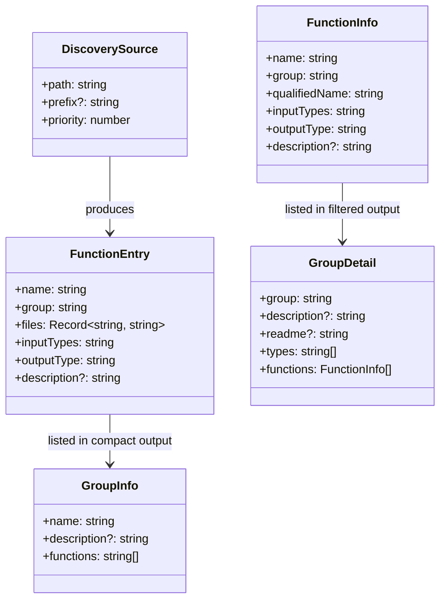

# Skill-Bundled BAML & Described Function Discovery

## Requirements

- Extend pi-baml discovery to scan skill directories (`~/.agents/skills/*/baml/`) so skill-authored BAML functions register automatically alongside general-purpose ones
- Add description metadata to BAML function groups via `README.md` so agents can autonomously decide when to use them
- Inject an `<available_baml_functions>` block into the system prompt (matching the `<available_skills>` pattern) so the agent knows what's available without calling any tool
- Surface full function details (signatures, types, README body) via a filtered `baml_list` call so the agent can learn how to call a function before invoking it
- Maintain separation: non-skill groups are advertised in system prompt; skill-colocated groups (`skill:*`) are registered but not advertised
- Support graceful degradation: skills that bundle BAML still work if pi-baml is unavailable (the SKILL.md instructions guide fallback to natural language reasoning)

### Definition of Done

- System prompt includes `<available_baml_functions>` block with one entry per non-skill group (matching `<available_skills>` XML format)
- Discovery scans `~/.agents/skills/*/baml/` directories, registering groups with `skill:` prefix
- `README.md` frontmatter `description` field populates group descriptions
- `baml_list` returns compact index (unfiltered) or full detail with types/README (filtered)
- `baml.systemPrompt: false` setting disables prompt injection
- Existing tests pass; new unit tests cover skill-dir discovery, README parsing, system-prompt rendering
- At least one skill has a working bundled `.baml` file as proof of concept

## Entities



## Approach

### Strategy

Three incremental changes to pi-baml:

1. **Discovery extension** — add skill directories to the scan list. Each `~/.agents/skills/<name>/baml/` becomes a group with `skill:` prefix (e.g. `skill:diagnose`). Priority is lowest. Non-skill directories use the group name as-is.

2. **README.md metadata** — each group directory may contain a `README.md`. Its YAML frontmatter `description` field becomes the group description. The body is returned by `baml_list` when filtered. No external YAML parser — regex extraction of the simple `description` field.

3. **System-prompt injection** — via `before_agent_start` event, inject an `<available_baml_functions>` XML block listing all non-skill groups with descriptions. Includes preamble referencing `baml_run`, `baml_list`, `baml_exec`, and the `baml` skill.

### Key Design Decisions

**Skills-parallel model:**
BAML groups work like skills: system prompt advertises them (name + description), agent decides when to use one, calls `baml_list(group)` for details (like reading SKILL.md), then acts. No "list all" discovery tool needed — the system prompt IS discovery.

**`skill:` prefix for skill-colocated groups:**
Literal prefix in registry key — `skill:diagnose/ClassifyBugPhase` is the qualified name used in `baml_run`. No ambiguity with global groups, no hidden metadata. What you see is what you call.

**Skill-colocated BAML not in system prompt:**
The skill's own SKILL.md tells the agent when/how to call its BAML functions. No duplication in the system prompt block. But `baml_list` shows everything (complete truth vs curated surface).

**`README.md` over `group.md`:**
Universal convention. Everyone knows what a README is. Frontmatter for machine-readable description, body for human-readable documentation and agent drill-down context.

**`baml_list` two response shapes:**
Unfiltered = compact index (names + descriptions + function names). Filtered = full detail (README body + type definitions + signatures). One tool, two purposes: overview vs drill-in.

**Type definitions in filtered output:**
Agent needs to know input/output shapes to construct valid `baml_run` calls. Including parsed type definitions (class/enum blocks) in the filtered response makes `baml_list(group)` fully self-contained — no second tool call needed.

**`before_agent_start` for system prompt injection:**
Established Pi pattern (used by claude-rules, preset extensions). Returns `{ systemPrompt: event.systemPrompt + block }`. Fires per-turn but the block is computed once from the static registry.

### Alternatives Rejected

- **YAML manifest:** Extra format, extra parser, no alignment with skill conventions.
- **Parse descriptions from BAML comments:** BAML doesn't have a standard doc-comment convention. Fragile, couples to evolving DSL.
- **Only discover skill BAML when skill is loaded:** Would require lazy registry updates mid-session. Registry is built once at startup.
- **Per-function descriptions:** Group-level descriptions are sufficient for agent discovery. Functions within a group share purpose. Full details come from `baml_list` filtered output.
- **`triggers` field:** YAGNI — description alone is sufficient for agent decision-making. `README.md` frontmatter is extensible; triggers can be added later without breaking changes.
- **Separate namespaces for skill/global:** Adds complexity. `skill:` prefix achieves isolation with flat namespace simplicity.
- **No opt-out setting:** Simple boolean setting costs nothing and handles edge cases where users want functions registered but not advertised.

## Structure

### New/Modified Files

```
src/lib/
├── discovery.ts          ← MODIFIED: add skill directory scanning, README.md reading
├── types.ts              ← MODIFIED: add description to FunctionEntry/FunctionInfo, add GroupInfo/GroupDetail
├── registry.ts           ← MODIFIED: carry descriptions, filter README.md from compilation files, add listGroups/describeGroup methods
├── readme-parser.ts      ← NEW: parseReadmeDescription(content) → string | undefined
├── type-parser.ts        ← NEW: parseTypeDefinitions(source) → string[]
├── system-prompt.ts      ← NEW: renderBamlSystemPrompt(registry) → string | null

src/tools/
├── baml-list.ts          ← MODIFIED: two response shapes (compact/full), updated tool description

src/
├── index.ts              ← MODIFIED: before_agent_start handler for system prompt injection
├── lib/config.ts         ← MODIFIED: add systemPrompt boolean to BamlSettings
```

### Discovery Directory Priority (updated)

```
1. ~/.agents/skills/*/baml/     (skill-specific, prefix "skill:", lowest priority)
2. ~/.agents/baml/              (global general-purpose)
3. ~/.pi/baml/                  (pi-local)
4. [settings.functionsDirs]     (extra dirs from config)
5. <cwd>/.pi/baml/              (project pi convention)
6. <cwd>/.agents/baml/          (project agents convention, highest priority)
```

### README.md Format

```markdown
---
description: Extract TODO items from freeform text — meeting notes, changelogs, code comments.
---

# Extract TODOs

This group provides structured extraction of action items from unstructured text.

## Functions

- **ExtractTodos** — main extraction, returns typed TodoItem[] with priority and assignee
- **CategorizeItems** — post-process extracted items into project categories

## Usage Notes

Call ExtractTodos first, then optionally pipe results to CategorizeItems for organization.
```

Frontmatter `description` = system prompt entry. Body = returned by `baml_list` filtered output.

### System-Prompt Block Format

```xml
<available_baml_functions>
BAML function groups callable via the baml_run tool.
Call baml_list with a group name to see function signatures and types before invoking.
For ad-hoc structured extraction, use baml_exec (see the baml skill for authoring guidance).

  <group>
    <name>extract-todos</name>
    <description>Extract TODO items from freeform text — meeting notes, changelogs, code comments.</description>
  </group>
  <group>
    <name>humanizer-audit</name>
    <description>Detect AI writing patterns and suggest fixes.</description>
  </group>
  <group>
    <name>code-metrics</name>
  </group>
</available_baml_functions>
```

Groups without a README.md description appear with just `<name>` (no `<description>` element).

### `baml_list` Response Shapes

**Unfiltered (no group param):**
```json
{
  "groups": [
    { "name": "extract-todos", "description": "Extract TODO items from freeform text...", "functions": ["ExtractTodos", "CategorizeItems"] },
    { "name": "skill:diagnose", "description": "Diagnosis assistance...", "functions": ["ClassifyBugPhase", "SuggestHypotheses"] }
  ]
}
```

**Filtered (group param provided):**
```json
{
  "group": "extract-todos",
  "description": "Extract TODO items from freeform text...",
  "readme": "# Extract TODOs\n\nThis group provides structured extraction...",
  "types": [
    "class TodoItem {\n  description string\n  priority \"high\" | \"medium\" | \"low\"\n  assignee string?\n}"
  ],
  "functions": [
    { "name": "ExtractTodos", "qualifiedName": "extract-todos/ExtractTodos", "inputTypes": "notes: string", "outputType": "TodoItem[]" },
    { "name": "CategorizeItems", "qualifiedName": "extract-todos/CategorizeItems", "inputTypes": "items: TodoItem[]", "outputType": "CategorizedItems" }
  ]
}
```

### `baml_list` Tool Description

```
List available BAML functions from the registry.

Without a group filter: returns a compact index of all groups with names, descriptions, and function names.
With a group filter: returns full detail including README documentation, type definitions, and function signatures — everything needed to construct a baml_run call.

Use this before calling baml_run to understand function signatures and expected input/output types.
```

## Operations

### 1. Add types for new response shapes

**File:** `src/lib/types.ts`

- Add `description?: string` to `FunctionEntry` and `FunctionInfo`
- Add `GroupInfo` type: `{ name: string; description?: string; functions: string[] }`
- Add `GroupDetail` type: `{ group: string; description?: string; readme?: string; types: string[]; functions: FunctionInfo[] }`
- Add `systemPrompt?: boolean` to `BamlSettings` (default: `true`)

### 2. Create README parser

**File:** `src/lib/readme-parser.ts`

- `parseReadmeDescription(content: string): string | undefined`
- Extracts `description` from YAML frontmatter between `---` delimiters
- Simple regex — no external YAML parser dependency
- Returns `undefined` if no frontmatter or no description field
- Separate function: `parseReadmeBody(content: string): string | undefined` — returns content after frontmatter closing `---`

### 3. Create type definition parser

**File:** `src/lib/type-parser.ts`

- `parseTypeDefinitions(source: string): string[]`
- Extracts `class` and `enum` block definitions from BAML source
- Returns raw BAML blocks as strings (agent knows BAML syntax from skill)
- Regex-based: matches `class Name { ... }` and `enum Name { ... }` blocks

### 4. Extend discovery to scan skill directories

**File:** `src/lib/discovery.ts`

- Add `scanSkillDirectories(skillsDir: string): DiscoveredGroups` — scans `~/.agents/skills/*/baml/`
- Each skill directory containing a `baml/` subdirectory becomes a group with `skill:` prefix
- Inside each skill's `baml/`, all `.baml` files + `README.md` are read
- Update `discoverBamlGroups()` to accept optional `skillsDirs: string[]` parameter
- Insert skill directories at lowest priority position in scan order
- Also read `README.md` in all discovery directories (not just skill ones)

### 5. Update registry to carry descriptions and support new queries

**File:** `src/lib/registry.ts`

- Modify `fromGroups` to accept enriched input including `README.md` content
- After building file map per group, call `parseReadmeDescription(readme)` to extract description
- Each `FunctionEntry` gets `description` from its group's README
- Filter `README.md` out of `files` before storing in entry (BAML compiler must not see it)
- Add `listGroups(): GroupInfo[]` — returns compact group summaries
- Add `describeGroup(group: string): GroupDetail | undefined` — returns full detail with types parsed from source files
- Keep existing `resolve()` and `list()` methods

### 6. Update `baml_list` tool

**File:** `src/tools/baml-list.ts`

- Update tool description to explain both response shapes
- When no `group` param: call `registry.listGroups()` → return `{ groups: [...] }`
- When `group` param provided: call `registry.describeGroup(group)` → return full detail
- Include README body, parsed type definitions, and function signatures in filtered response
- Return error if filtered group doesn't exist

### 7. Create system-prompt renderer

**File:** `src/lib/system-prompt.ts`

- `renderBamlSystemPrompt(registry: FunctionsRegistry): string | null`
- Returns `null` if registry has no non-skill groups
- Renders `<available_baml_functions>` XML block with preamble
- One `<group>` element per non-skill group (excludes `skill:*` prefix groups)
- `<description>` element only when present (no empty elements)
- Sorted alphabetically by group name

### 8. Wire system-prompt injection in extension entry

**File:** `src/index.ts`

- Add `before_agent_start` event handler
- If `settings.systemPrompt !== false` and rendered block is non-null, append to `event.systemPrompt`
- Compute the block once at factory time (registry is static), return cached string per turn

### 9. Update settings parsing

**File:** `src/lib/config.ts`

- Add `systemPrompt` boolean to settings parsing (default: `true`)
- `parseBamlSettings` reads `baml.systemPrompt` from settings

### 10. Unit tests

**Files:** new `tests/unit/readme-parser.test.ts`, new `tests/unit/type-parser.test.ts`, extended `tests/unit/discovery.test.ts`, extended `tests/unit/registry.test.ts`, new `tests/unit/system-prompt.test.ts`

- `readme-parser.test.ts`: valid frontmatter, missing frontmatter, no README, multi-line description, description with colons/quotes
- `type-parser.test.ts`: class extraction, enum extraction, nested types, multiple types per file, no types
- `discovery.test.ts`: skill directory scanning — skill with baml/, skill without baml/, skill with README.md, `skill:` prefix applied
- `registry.test.ts`: description propagation, listGroups output, describeGroup output, README filtered from entry files, type definitions included
- `system-prompt.test.ts`: empty registry → null, populated registry → valid XML block, skill groups excluded, groups without descriptions, alphabetical sorting, opt-out setting

### 11. Integration test: skill BAML discovery

**File:** `tests/integration/skill-discovery.test.ts`

- Create temp directory structure mimicking `~/.agents/skills/diagnose/baml/`
- Place a real `.baml` file + `README.md`
- Run discovery → registry → verify `skill:diagnose` group found with correct description
- Verify `.baml` compiles via BamlRuntime (no README.md contamination)
- Verify system prompt renders without skill groups

## Norms

- Follow existing pi-baml conventions: pure functions, minimal interfaces, explicit error wrapping
- README parsing is a pure function (receives content string, not file path)
- Type parsing is a pure function (receives BAML source string)
- Discovery remains synchronous (filesystem reads at startup)
- System-prompt block follows the XML-tag convention used by Pi's skill injection
- `README.md` is a documentation file with machine-readable frontmatter — body is for humans AND the agent (via `baml_list`)
- Tool description for `baml_list` must clearly explain both response shapes so agents know what to expect

## Safeguards

- **MUST NOT** pass `README.md` to `BamlRuntime.fromFiles()` — BAML compiler will error on markdown content. Filter before compilation.
- **MUST NOT** break existing discovery behavior — all current discovery directories and priority ordering remain unchanged. Skill dirs are additive at lowest priority.
- **MUST NOT** require `README.md` — groups without it still work (no description, no README body in detail output).
- **MUST** keep the registry build synchronous and at startup time — no lazy discovery mid-session.
- **MUST** handle skill directories that don't exist gracefully (silent skip).
- **MUST** keep system-prompt injection under 2KB even with many groups — one entry per group (not per function), no full signatures in prompt.
- **MUST NOT** add runtime dependencies — frontmatter parsing uses regex, type parsing uses regex.
- **MUST** use `skill:` prefix as literal registry key for skill-colocated groups — qualified names include the prefix.
- **MUST** exclude `skill:*` groups from system prompt block — they are internal to their owning skill.
- **MUST** include `skill:*` groups in `baml_list` output — the tool shows complete truth.
- **MUST NOT** include `README.md` body in unfiltered `baml_list` — only in filtered response to control token usage.
- **MUST** validate that filtered group exists — return error if `baml_list(group: "nonexistent")` is called.
- **OUT OF SCOPE:** Per-function descriptions, trigger-based auto-invocation, dynamic registry updates after startup, changes to `baml_exec` tool interface, `baml_run` interface changes.
